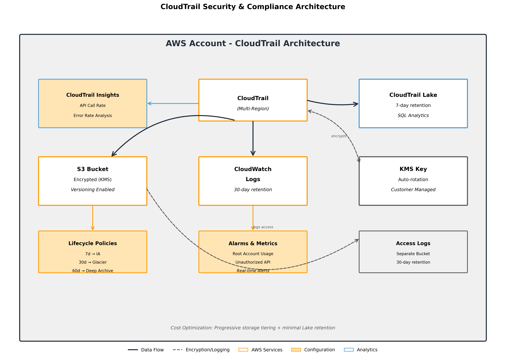

# CloudTrail with S3 and CloudTrail Lake - CloudFormation Template

A production-ready AWS CloudFormation template that deploys a comprehensive CloudTrail logging solution with S3 storage, KMS encryption, lifecycle policies, and CloudTrail Lake for advanced analytics.

## Table of Contents

- [Overview](#overview)
- [Features](#features)
- [Architecture](#architecture)
- [Prerequisites](#prerequisites)
- [Deployment](#deployment)
- [Configuration](#configuration)
- [Design Decisions](#design-decisions)
- [Cost Optimization](#cost-optimization)
- [Security Best Practices](#security-best-practices)
- [Monitoring and Alerting](#monitoring-and-alerting)
- [Troubleshooting](#troubleshooting)
- [License](#license)

## Overview

This CloudFormation template creates a complete AWS CloudTrail logging infrastructure designed for single-account deployments with enterprise-grade security, compliance, and cost optimization features. The solution provides both long-term storage in S3 and short-term analytics capabilities through CloudTrail Lake.

## Features

- **Multi-Region Trail**: Captures events from all AWS regions
- **KMS Encryption**: Customer-managed KMS key with automatic rotation
- **S3 Lifecycle Management**: Automated transition through storage tiers (Standard → IA → Glacier → Deep Archive)
- **CloudTrail Lake**: 7-day retention for SQL-based event analysis
- **CloudWatch Integration**: Real-time log streaming and metric-based alerting
- **Security Monitoring**: Built-in alarms for root account usage and unauthorized API calls
- **Access Logging**: Separate S3 bucket for audit trail access logs
- **Log File Validation**: Ensures log file integrity
- **Insights**: API call rate and error rate insights
- **Cost Optimized**: Intelligent tiering and retention policies

## Architecture



The architecture provides a comprehensive logging solution with:
- **CloudTrail**: Multi-region trail capturing all API activities
- **CloudTrail Lake**: 7-day retention for SQL-based analytics
- **S3 Storage**: Long-term encrypted storage with lifecycle policies
- **CloudWatch Integration**: Real-time monitoring and alerting
- **KMS Encryption**: Customer-managed keys with automatic rotation
- **Cost Optimization**: Progressive storage tiering from Standard to Deep Archive

## Prerequisites

Before deploying this template, ensure you have:

1. **AWS Account**: An active AWS account with appropriate permissions
2. **AWS CLI**: Installed and configured with credentials
3. **Permissions**: IAM permissions to create:
   - CloudTrail trails
   - S3 buckets and policies
   - KMS keys
   - CloudWatch log groups and alarms
   - IAM roles
   - CloudTrail Lake event data stores

## Deployment

### Using AWS CLI

```bash
# Deploy the stack
aws cloudformation create-stack \
  --stack-name cloudtrail-stack \
  --template-body file://cloudtrail-stack.yaml \
  --parameters \
    ParameterKey=TrailName,ParameterValue=my-organization-trail \
    ParameterKey=RetentionInDays,ParameterValue=90 \
    ParameterKey=CloudTrailLakeRetentionDays,ParameterValue=7 \
  --capabilities CAPABILITY_NAMED_IAM \
  --region us-west-2

# Monitor deployment status
aws cloudformation describe-stacks \
  --stack-name cloudtrail-stack \
  --query 'Stacks[0].StackStatus' \
  --region us-west-2

# Wait for completion
aws cloudformation wait stack-create-complete \
  --stack-name cloudtrail-stack \
  --region us-west-2
```

### Using AWS Console

1. Navigate to CloudFormation in the AWS Console
2. Click "Create Stack" → "With new resources"
3. Upload the `cloudtrail-stack.yaml` file
4. Configure parameters according to your requirements
5. Review and acknowledge IAM capability requirements
6. Create the stack

### Update Existing Stack

```bash
aws cloudformation update-stack \
  --stack-name cloudtrail-stack \
  --template-body file://cloudtrail-stack.yaml \
  --parameters \
    ParameterKey=RetentionInDays,ParameterValue=180 \
  --capabilities CAPABILITY_NAMED_IAM \
  --region us-west-2
```

## Configuration

### Parameters

| Parameter | Default | Description | Valid Values |
|-----------|---------|-------------|--------------|
| `TrailName` | organization-cloudtrail | Name for the CloudTrail | Any valid string |
| `S3BucketPrefix` | cloudtrail-logs | Prefix for S3 bucket naming | Any valid S3 prefix |
| `RandomSuffix` | auto | Random suffix for resource names | auto (uses stack name) or custom string |
| `RetentionInDays` | 90 | Days to retain logs in S3 | 1-3653 |
| `GlacierTransitionDays` | 30 | Days before Glacier transition | 1-3653 |
| `DeepArchiveTransitionDays` | 60 | Days before Deep Archive | 1-3653 |
| `CloudTrailLakeRetentionDays` | 7 | Lake retention period | 7, 30, 90, 365, 2557 |
| `EnableLogFileValidation` | true | Enable integrity validation | true/false |
| `EnableS3DataEvents` | false | Log S3 data events | true/false |

### Recommended Configurations

#### For Development Environments
```yaml
RetentionInDays: 30
CloudTrailLakeRetentionDays: 7
EnableS3DataEvents: false
RandomSuffix: auto  # Auto-generates unique suffix
```

#### For Production Environments
```yaml
RetentionInDays: 90
CloudTrailLakeRetentionDays: 30
EnableS3DataEvents: true
EnableLogFileValidation: true
RandomSuffix: prod-$(date +%Y%m%d)  # Date-based suffix
```

#### For Compliance Requirements
```yaml
RetentionInDays: 2557  # 7 years
CloudTrailLakeRetentionDays: 365
EnableS3DataEvents: true
EnableLogFileValidation: true
RandomSuffix: compliance-$(date +%Y%m%d)
```

### Resource Naming and Conflict Prevention

**Enhanced Randomization**: All resource names now include Account ID for better uniqueness:

- **KMS Key Alias**: `alias/{TrailName}-kms-key-{StackName}-{AccountId}`
- **S3 Buckets**: `{Prefix}-{StackName}-{AccountId}-{Region}`
- **CloudTrail**: `{TrailName}-{StackName}-{AccountId}`
- **CloudTrail Lake**: `{TrailName}-lake-store-{StackName}-{AccountId}`
- **IAM Roles**: `{TrailName}-cloudwatch-role-{StackName}-{AccountId}`
- **Log Groups**: `/aws/cloudtrail/{TrailName}-{StackName}-{AccountId}`
- **CloudWatch Alarms**: `{TrailName}-{alarm-type}-{StackName}-{AccountId}`

This ensures:
✅ **No conflicts** when deploying multiple stacks in same account
✅ **Global uniqueness** for S3 buckets across all AWS accounts
✅ **Predictable naming** while maintaining uniqueness
✅ **Easy identification** of resources by account and stack

## Design Decisions

### 1. Multi-Region Trail
**Decision**: Enabled by default
**Rationale**: Ensures comprehensive visibility across all regions, critical for security incident investigation and compliance. Single-region trails miss important cross-region activities.

### 2. Separate S3 Buckets for Logs
**Decision**: Dedicated access logs bucket
**Rationale**: Prevents recursive logging issues and simplifies access pattern analysis. Segregation improves security posture and reduces storage costs.

### 3. KMS Encryption with Customer-Managed Keys
**Decision**: CMK with automatic rotation
**Rationale**: Provides full control over encryption keys, enables cross-account access if needed, and meets compliance requirements. Auto-rotation enhances security without operational overhead.

### 4. S3 Lifecycle Policies
**Decision**: Progressive tiering (Standard → IA → Glacier → Deep Archive)
**Rationale**: Optimizes storage costs while maintaining accessibility. Recent logs stay readily available, older logs move to cheaper storage, balancing cost and compliance.

### 5. CloudTrail Lake with 7-Day Default
**Decision**: Short retention for Lake, long for S3
**Rationale**: Lake provides powerful SQL querying but is expensive. 7-day retention covers immediate investigation needs while S3 handles long-term compliance storage at lower cost.

### 6. CloudWatch Integration
**Decision**: Stream to CloudWatch Logs with metrics
**Rationale**: Enables real-time alerting and integration with AWS security services. Metric filters provide immediate detection of security events.

### 7. Insights Enabled
**Decision**: Both API call rate and error rate insights
**Rationale**: Proactive anomaly detection without additional configuration. Helps identify unusual patterns that might indicate security incidents or operational issues.

### 8. Versioning and MFA Delete Disabled
**Decision**: Versioning enabled, MFA delete not required
**Rationale**: Versioning provides protection against accidental deletion. MFA delete adds operational complexity that may not be justified for all environments.

## Cost Optimization

### Estimated Monthly Costs

| Component | Estimated Cost | Notes |
|-----------|---------------|-------|
| CloudTrail | $0-2 | First trail free in each region |
| S3 Storage | $0.023/GB | Standard tier, reduces with lifecycle |
| Glacier Storage | $0.004/GB | After 30 days |
| Deep Archive | $0.001/GB | After 60 days |
| CloudTrail Lake | $2.5/GB ingested | Plus $0.005/GB for queries |
| KMS | $1/month | Plus $0.03 per 10k requests |
| CloudWatch Logs | $0.50/GB | Ingestion and storage |
| **Total Estimate** | $10-50/month | Varies by event volume |

### Cost Optimization Strategies

1. **Tune CloudTrail Lake Retention**: Keep minimal (7 days) unless actively used
2. **Disable S3 Data Events**: Only enable if specifically required
3. **Adjust Lifecycle Policies**: Move to cheaper storage tiers faster
4. **Use S3 Intelligent Tiering**: Consider for unpredictable access patterns
5. **Regular Log Cleanup**: Delete logs beyond compliance requirements

## Security Best Practices

### Implemented Controls

- ✅ **Encryption at Rest**: KMS encryption for all storage
- ✅ **Encryption in Transit**: SSL/TLS enforced via bucket policy
- ✅ **Access Logging**: Separate bucket for audit trails
- ✅ **Public Access Blocking**: All public access denied
- ✅ **Log Validation**: Integrity checking enabled
- ✅ **Key Rotation**: Automatic KMS key rotation
- ✅ **Least Privilege**: Minimal IAM permissions
- ✅ **Monitoring**: CloudWatch alarms for suspicious activity
- ✅ **Unpredictable S3 Bucket Names**: Non-guessable bucket naming to prevent enumeration attacks
- ✅ **Multi-Stack Deployment**: Unique resource names allowing multiple deployments
- ✅ **Auto-Cleanup**: S3 buckets configured for deletion even when containing files

### Security Enhancements

#### S3 Bucket Name Randomization
To prevent bucket enumeration attacks, S3 bucket names use unpredictable patterns:

**Before**: `cloudtrail-logs-123456789012-us-west-2` (easily guessable)
**After**: `cloudtrail-logs-my-stack-name-123456789012` (unpredictable)

- Uses CloudFormation stack name (contains random UUID) or custom random suffix
- Eliminates predictable region-based naming
- Prevents attackers from guessing bucket names for reconnaissance

#### Multi-Stack Deployment Support
All resource names include randomization to prevent conflicts:

- CloudTrail names: `organization-cloudtrail-{stack-name}`
- KMS key aliases: `alias/organization-cloudtrail-kms-key-{stack-name}`
- CloudWatch log groups: `/aws/cloudtrail/organization-cloudtrail-{stack-name}`
- CloudTrail Lake stores: `organization-cloudtrail-lake-store-{stack-name}`

This enables:
- Multiple deployments in the same account (dev/staging/prod)
- Testing and development environments
- Blue/green deployment strategies

#### Stack Cleanup Improvements
- S3 buckets configured with `DeletionPolicy: Delete`
- Automatic cleanup even when buckets contain files
- Prevents orphaned resources and incomplete deletions

### Additional Recommendations

1. **Enable MFA Delete**: For production environments with strict compliance
2. **Cross-Account Backup**: Replicate critical logs to a security account
3. **Regular Audits**: Review CloudTrail Lake queries and access patterns
4. **Integration**: Connect with AWS Security Hub and GuardDuty
5. **Automation**: Use AWS Config rules for continuous compliance

## Monitoring and Alerting

### Built-in Alarms

| Alarm | Trigger | Action Required |
|-------|---------|-----------------|
| Root Account Usage | Any root login | Immediate investigation |
| Unauthorized API Calls | 5+ failures in 5 min | Review and potentially rotate credentials |

### Creating Custom Alarms

```bash
# Example: Alert on IAM policy changes
aws logs put-metric-filter \
  --log-group-name /aws/cloudtrail/organization-cloudtrail \
  --filter-name IAMPolicyChanges \
  --filter-pattern '{ ($.eventName = PutUserPolicy) || ($.eventName = PutGroupPolicy) || ($.eventName = PutRolePolicy) || ($.eventName = CreatePolicy) || ($.eventName = DeletePolicy) }' \
  --metric-transformations \
    metricName=IAMPolicyChanges,metricNamespace=CloudTrailMetrics,metricValue=1
```

### CloudTrail Lake Queries

For a comprehensive collection of CloudTrail Lake SQL queries for security analysis and compliance monitoring, see [cloudtrail-lake-queries.md](cloudtrail-lake-queries.md).

Example queries included:
- Failed console logins and authentication attempts
- Root account usage tracking
- IAM policy and user lifecycle changes
- Security group modifications
- S3 bucket permission changes
- Cross-account activity monitoring
- CloudTrail configuration changes

Quick example:
```sql
-- Find all root account activities
SELECT eventTime, eventName, userIdentity.principalId, sourceIPAddress
FROM <event-data-store-id>
WHERE userIdentity.type = 'Root'
ORDER BY eventTime DESC
```

## Troubleshooting

### Common Issues and Solutions

#### Trail Not Logging
```bash
# Check trail status
aws cloudtrail get-trail-status --name organization-cloudtrail

# Start logging if stopped
aws cloudtrail start-logging --name organization-cloudtrail
```

#### S3 Access Denied
```bash
# Verify bucket policy
aws s3api get-bucket-policy --bucket cloudtrail-logs-<account-id>-<region>

# Check KMS key permissions
aws kms get-key-policy --key-id alias/organization-cloudtrail-kms-key --policy-name default
```

#### CloudWatch Logs Not Receiving Events
```bash
# Verify IAM role trust relationship
aws iam get-role --role-name organization-cloudtrail-cloudwatch-role

# Check log group exists
aws logs describe-log-groups --log-group-name-prefix /aws/cloudtrail/
```

#### High Costs
1. Review CloudTrail Lake retention settings
2. Check if S3 data events are necessary
3. Verify lifecycle policies are applied
4. Consider using S3 Intelligent-Tiering

### Validation Commands

```bash
# Validate template before deployment
aws cloudformation validate-template --template-body file://cloudtrail-stack.yaml

# Check stack outputs
aws cloudformation describe-stacks \
  --stack-name cloudtrail-stack \
  --query 'Stacks[0].Outputs'

# Test log file validation
aws cloudtrail validate-logs \
  --trail-arn arn:aws:cloudtrail:region:account-id:trail/organization-cloudtrail \
  --start-time 2024-01-01T00:00:00Z
```

## License

MIT License

Copyright (c) 2024

Permission is hereby granted, free of charge, to any person obtaining a copy
of this software and associated documentation files (the "Software"), to deal
in the Software without restriction, including without limitation the rights
to use, copy, modify, merge, publish, distribute, sublicense, and/or sell
copies of the Software, and to permit persons to whom the Software is
furnished to do so, subject to the following conditions:

The above copyright notice and this permission notice shall be included in all
copies or substantial portions of the Software.

THE SOFTWARE IS PROVIDED "AS IS", WITHOUT WARRANTY OF ANY KIND, EXPRESS OR
IMPLIED, INCLUDING BUT NOT LIMITED TO THE WARRANTIES OF MERCHANTABILITY,
FITNESS FOR A PARTICULAR PURPOSE AND NONINFRINGEMENT. IN NO EVENT SHALL THE
AUTHORS OR COPYRIGHT HOLDERS BE LIABLE FOR ANY CLAIM, DAMAGES OR OTHER
LIABILITY, WHETHER IN AN ACTION OF CONTRACT, TORT OR OTHERWISE, ARISING FROM,
OUT OF OR IN CONNECTION WITH THE SOFTWARE OR THE USE OR OTHER DEALINGS IN THE
SOFTWARE.